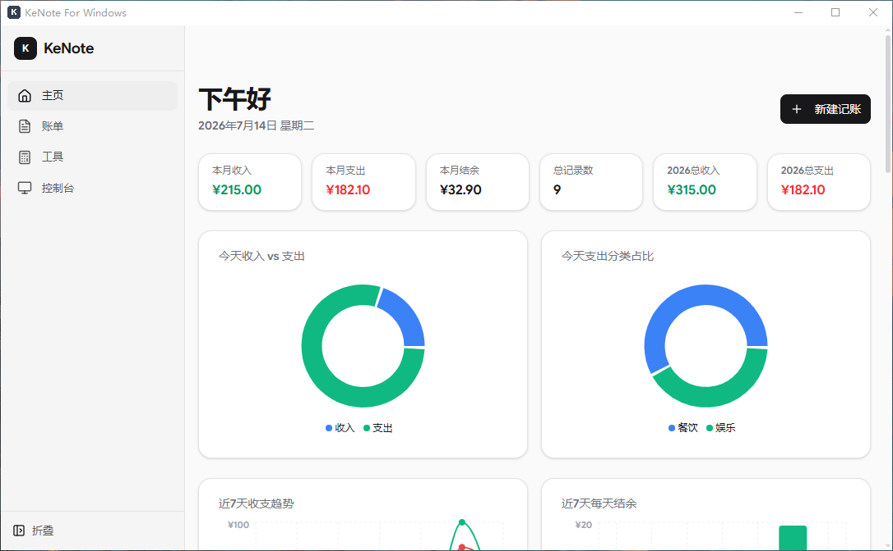
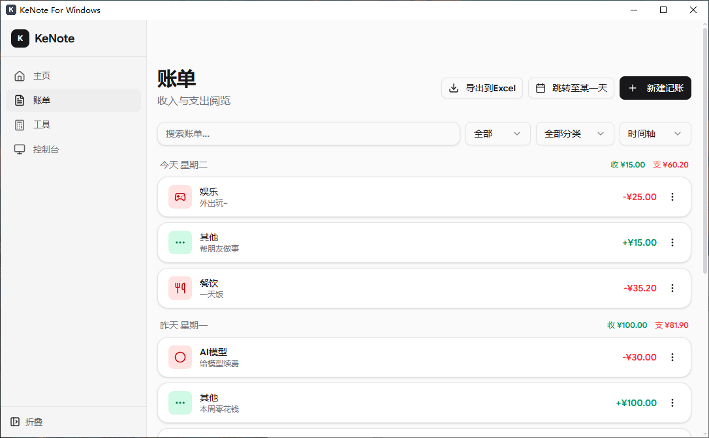
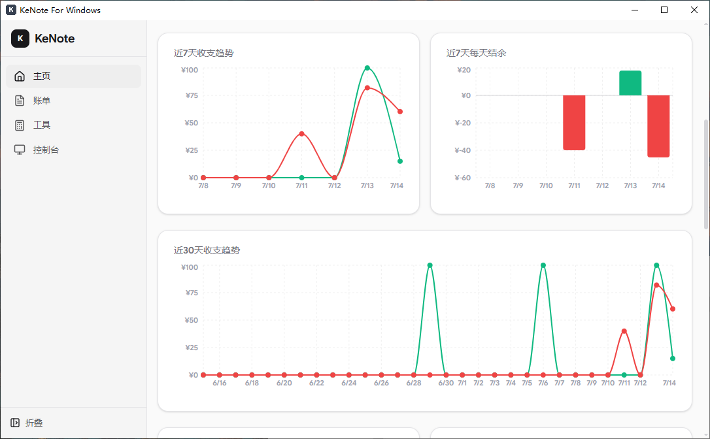
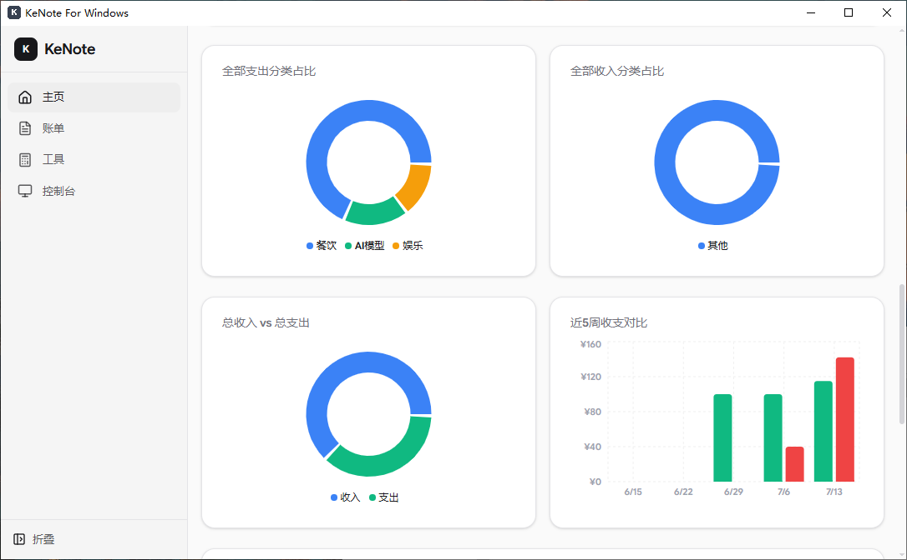
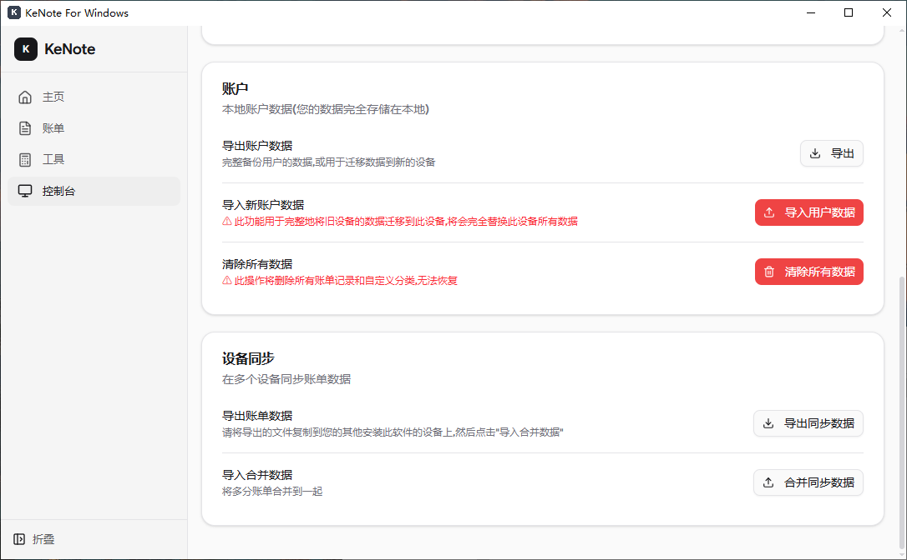

# KeNote

一款简洁高效的个人记账应用，支持收支管理、统计分析、数据导入导出等功能。

## 功能特性

- **收支记账** - 快速记录收入和支出，支持自定义分类和备注
- **数据可视化** - 丰富的图表展示，包括趋势图、饼图、柱状图、热力图等
- **账单筛选** - 按类型、分类、日期筛选账单，支持关键词搜索
- **时间轴视图** - 时间轴和热力图两种展示方式，直观查看账单分布
- **数据导出** - 支持导出账单数据为 Excel 格式，方便备份和分析
- **数据导入** - 支持导入备份数据，数据迁移更便捷
- **自定义分类** - 支持添加和删除自定义分类，满足个人需求
- **内置计算器** - 提供便捷的计算工具，日常算账更轻松
- **暗色模式** - 支持亮色/暗色主题切换
- **响应式设计** - 完美适配桌面端和移动设备

## 截图

### 首页概览



### 账单列表



### 收支分类



### 回收站



### 用户中心



## 技术

## **框架**: React 19 + TypeScript

- **构建工具**: Vite 6
- **UI 组件**: shadcn/ui + Radix UI
- **样式**: Tailwind CSS
- **路由**: React Router
- **状态管理**: Zustand (支持数据持久化)
- **图标**: Lucide
- **图表**: Recharts
- **日期处理**: date-fns + react-day-picker

## 安装

### 环境要求

- Node.js >= 18
- npm 或 yarn 或 pnpm

### 克隆项目

```bash
git clone https://github.com/wanyyq/KeNote.git
cd KeNote
```

### 安装依赖

```bash
npm install
```

## 快速开始

### 开发模式

```bash
npm run dev
```

访问 [http://localhost:5173](http://localhost:5173)

### 构建生产版本

```bash
npm run build
```

### 预览生产构建

```bash
npm run preview
```

## 功能说明

### 首页

- 展示本月收入、支出、结余等统计信息
- 提供多种数据可视化图表：
  - 今天收入 vs 支出饼图
  - 今天支出分类占比
  - 近7天/30天收支趋势图
  - 近7天每天结余柱状图
  - 全部收入/支出分类占比
  - 近5周收支对比
  - 收入/支出热力图

### 账单页

- 按日期时间轴展示所有账单
- 支持筛选：类型（收入/支出/全部）、分类、关键词搜索
- 支持时间轴/热力图两种视图切换
- 支持日期快速跳转
- 支持编辑、删除账单
- 支持调整账单日期
- 支持导出 Excel

### 工具页

- 内置计算器，方便日常计算

### 设置页

- 数据备份/恢复
- 自定义分类管理
- 数据清除

### 添加新功能

1. 在 `src/pages/` 创建页面组件
2. 在 `src/components/` 创建复用组件
3. 使用 Zustand 管理状态（如需要）
4. 在 `src/App.tsx` 配置路由

### 样式规范

项目使用 Tailwind CSS + shadcn/ui 组件库，遵循以下规范：

- 优先使用 shadcn/ui 组件
- 使用 Tailwind CSS 类进行样式定制
- 保持组件设计一致性

### 数据持久化

使用 Zustand 的 persist 中间件，数据自动保存在 localStorage，key 为 `kenote-storage`

## Releases

提供预编译版本：

- Web版 (1MB)
- Windows版 (3MB) - 需要 .NET 10 运行时，仅支持 Windows 10 及以上版本
- 安卓版 (4MB)

客户端体积小巧是因为依赖 WebView 进行渲染。

## 许可证

MIT

## 贡献

欢迎提交 Issue 和 Pull Request！

## 联系方式

如有问题或建议，请通过 Issue 与我们联系。